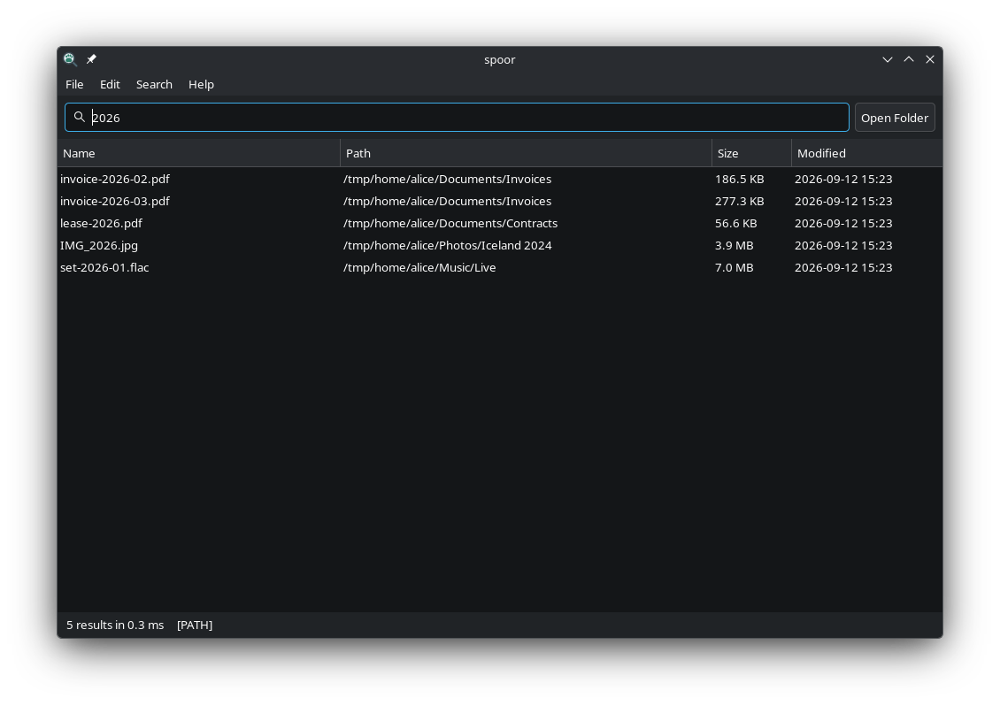

# spoor

Instant file-name search for Linux. Type a few letters; the results are
already there.

Inspired by [Everything](https://www.voidtools.com/) on Windows, which stays
instant by reading the filesystem's own record of what changed. spoor does the
same on Linux, where that record does not exist, by having the kernel report
every change as it happens.

## How it works

A small background service keeps an index of your files up to date as they
change, and the window just asks it questions. Because the index is always
current, a search answers in about a millisecond across millions of files, and
a file you saved a second ago is already in the results.

The service runs with privileges, so the kernel can tell it about every change
on a disk at once instead of watching each folder separately. It never shows
you more than you could see yourself: every result is checked against your own
permissions first.

### How fast

<picture>
  <source media="(prefers-color-scheme: dark)" srcset="docs/benchmark-dark.png">
  
</picture>

[bench/](bench/README.md) has the rest: searches that match tens of thousands
of files, how soon a new file turns up, what watching a disk costs, and where
spoor comes off worse.

## Installing

On Ubuntu 22.04 or newer, Debian 12 or newer, and systems based on them (Linux
Mint, Pop!_OS and others), download the package from the
[latest release](https://github.com/Noam5/spoor/releases/latest) — `amd64` for
most PCs, `arm64` for ARM machines — and install it from the folder you saved
it in:

    sudo apt install ./spoor_*_amd64.deb

The service starts by itself; **File Search** is in your application menu. In
KDE, Alt+Space searches files too once you log in again.

To remove it, `sudo apt remove spoor`. `sudo apt purge spoor` also deletes the
index and your folder settings.

### Building it yourself

    make build
    sudo make install
    sudo systemctl enable --now spoor

For searching from KDE's launcher with Alt+Space, add `make install-krunner`.
To remove everything, `sudo make uninstall`.

## Using it

Open **File Search** from your application menu. Type in the box and results
appear as you go. Enter or a double-click opens one.

Searching:

* One word matches file names: `invoice` finds `invoice-2026-03.pdf`.
* Several words must all appear, in the name or in the folders above it:
  `wedding jpg` finds `Photos/Wedding 2019/IMG_0421.jpg`.
* Quotation marks keep words together: `"annual report"`.
* A `/` searches the whole path: `Photos/Iceland`. Ending with `/` means
  "everything inside that folder".
* Case is ignored, in every language: `отчёт` finds `Отчёт.pdf`.

The Search menu holds Match Case (Ctrl+I), Enable Regex (Ctrl+R), Search in
Path (Ctrl+U), and a filter for files or folders only.

Click a column heading to sort by name, folder, size or date. Right-click a
result to open it with another application, show the folder it is in, copy its
name or path, move it to the trash, or open its properties.

Preferences (Ctrl+P) has the rest: search as you type, hidden files, and how
many results to show.

## Choosing which folders to index

Preferences lists the folders that are indexed, folders to leave out, and
network folders. **Apply Folder Changes…** asks for an administrator password,
because the index is shared by everyone on the machine, and then re-indexes.

Folders on separate disks are all kept current. A folder on a disk that is not
plugged in is skipped until it comes back.

## Cloud and network folders

A mounted cloud drive cannot announce its changes the way a local disk does,
so spoor re-reads it on a timer — every 15 minutes by default. Add it under
**Network folders** in Preferences.

Such a mount is normally private to you, and the service cannot read it. With
rclone, mount using `--allow-other --default-permissions --umask 077`: the
kernel keeps the files owner-only while letting the service read their names.
This also needs `user_allow_other` in `/etc/fuse.conf`. The first read after
mounting fetches the listing from the provider and can take a while; the
results appear once it finishes.

## Requirements

* Linux 5.9 or newer, systemd, and root to install.
* Works on ext4, btrfs and xfs.
* To build: Rust 1.87 or newer and the GTK 3 development files
  (`libgtk-3-dev`). The launcher plugin needs KDE Plasma 6.

## Privacy and security

The service can see every file name in the folders it indexes, so:

* **You see only what you could see anyway.** Every result is checked against
  your own permissions, by the kernel, before it reaches you.
* The saved index is readable by root alone.
* Only an administrator can change which folders are indexed.
* File contents are never read — only names, plus the size and date your own
  system reports for the results on screen.

[SECURITY.md](SECURITY.md) has the details, and how to report a vulnerability.

## Limits

* Deleted files keep their place in memory until the nightly rebuild.
* A search whose every word is shorter than three letters has to look at
  everything: about a second on a very large index.
* Letters are matched one for one, so `ß` does not match `ss`.
* Copying a name copies text, so a name containing unusual bytes is copied
  with those replaced.

## License

Licensed under either of the Apache License, Version 2.0
([LICENSE-APACHE](LICENSE-APACHE)) or the MIT license
([LICENSE-MIT](LICENSE-MIT)), at your option.
